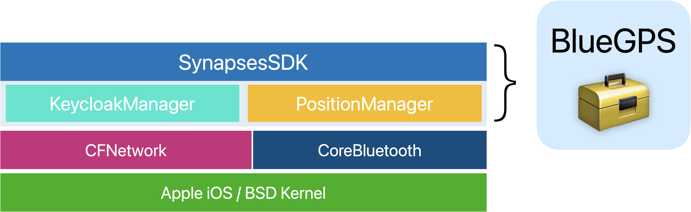
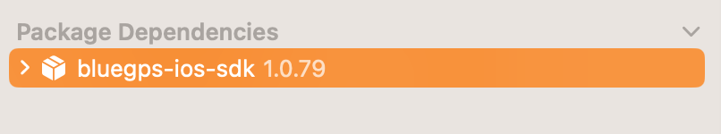
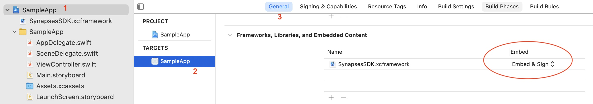
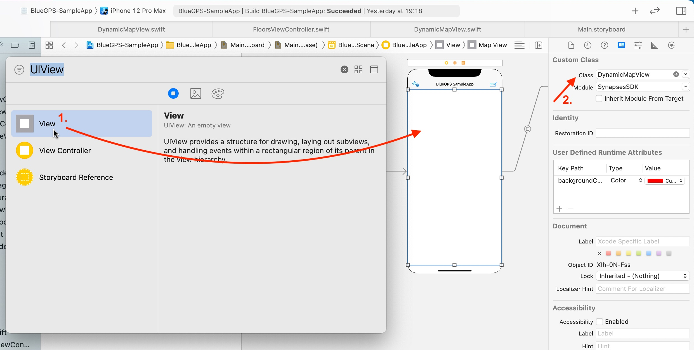
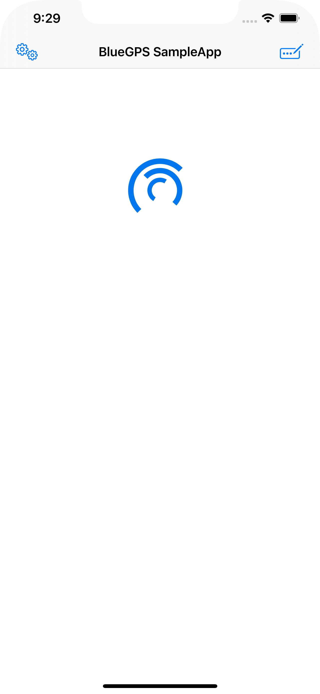
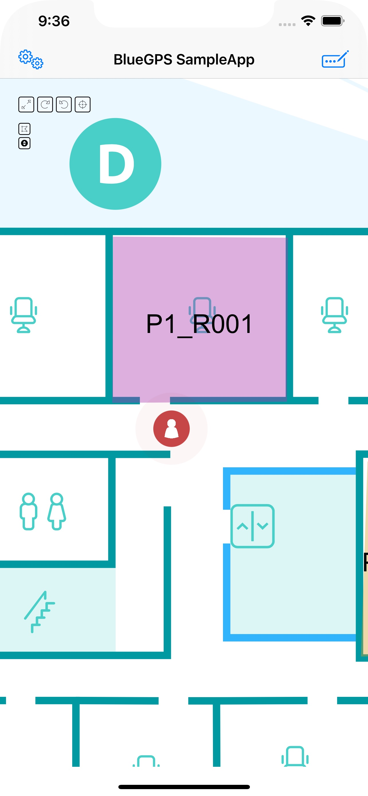

BlueGPS iOS SDK
==

[TOC]


<div style="page-break-after: always"></div>

# 1. Requirements

BlueGPS SDK is designated to be used with Xcode 12 or later. The following build setting is also required (as minimum):

```
iOS Deployment Target: iOS 13.0
```

The Framework is distributed as XCFramework bundle, containing slices for the following architectures:

- arm64
- x86_64

<div style="page-break-after: always"></div>

# 2. Getting Started

Synapses SDK is distributed as an Apple XCFramework for maximum compatibility. It offers some abstractions built on top of Apple foundamental frameworks to give you all the required functionalities to work correctly with Synapses systems and BlueGPS framework.





The SDK is made up of one main component named `BlueGPS` that comes in the form of a *singleton* instance that needs to be properly initialized in order to be used correctly.


## 2.1. SDK import

> [!IMPORTANT]
>
> This document cover the complete flow in order to use and import SynapseSDK into a native / Xcode app. Further or different integration steps could be necessary for different platforms.


> [!TIP]
>
> The most straightforward way to get ready with the SDK is to import it through SPM:
>
> **Xcode** ➔ File ➔ **Add package dependencies**
>
> In the url field insert:
>
> https://github.com/synapseslab/ios-bluegps-sdk-public
>
> You will end with the package correctly added as a dependency in your project:
>
> 


Alternatively, but not recommended, you could add the SDK *manually* in your project by downloading the last **xcframework.zip** from 

https://github.com/synapseslab/ios-bluegps-sdk-public

and put it into your project.

As a final step, you need to be sure that the SDK is correctly flagged as `Embed&Sign` in your main project (Fig.1)



Once the SDK is correctly imported, you will get access to all the required symbols and object that we will discuss later in this guide.

<div style="page-break-after: always"></div>


# 3. Initializing the SDK

> [!IMPORTANT]
>
> Your project must add at least the following key in Info.plist `NSBluetoothAlwaysUsageDescription` in order to work properly. To do that, please, open the Info.plist file from your navigator and add a new ROW, with the relevant KEY as well as a description of what you want to do with Bluetooth access.

```xml
<key>NSBluetoothAlwaysUsageDescription</key>
<string>A string value explaining to the user how the app uses this data.</string>
```


To ensure reliability and smoothness into user positioning we strongly suggest to add also the following keys:

```xml 
	<key>NSBluetoothPeripheralUsageDescription</key>
	<string>BlueGPS needs to use Bluetooth is required to estimate your position inside the building.</string>
	<key>NSLocationAlwaysAndWhenInUseUsageDescription</key>
	<string>BlueGPS needs to access location to provide you proximity services.</string>
	<key>NSLocationAlwaysUsageDescription</key>
	<string>BlueGPS needs to access location even when in background to provide you proximity services.</string>
	<key>NSLocationUsageDescription</key>
	<string>BlueGPS needs to access location to provide you proximity services.</string>
	<key>NSLocationWhenInUseUsageDescription</key>
	<string>BlueGPS needs to access location when in use to provide you proximity services.</string>
	<key>NSMotionUsageDescription</key>
	<string>BlueGPS needs to access your motion activity to improve your position estimation inside the building.</string>
```


To initialize the SDK, the first thing to do is to instruct correctly the engine in order to store all the required informations into an EnvironmentModel used along the SDK, as well as to configure the authentication mechanism.


The SDK could be configured either from your app Info.plist or programmatically. Specifically the following keys are required at a minimum to ensure everything is working properly:


> [!TIP]
>
> You should contact our support team to get valid and working parameters for your installations.


In order to be used, first of all, you need to add the correct import directive into your project where required:

```swift
import SynapsesSDK
```


If you use the Info.plist as configuration method, you can launch the SDK setup simply with:

```swift
BlueGPS.setupSDK()
```


This factory method should be called at the very beginning of your app launch. Choose carefully and appropriatelly where to put it.

<div style="page-break-after: always"></div>

## 3.1. Network setup

BlueGPS relies on Keycloak as authentication manager. Once the SDK is setup, you should instruct the underlying layer to behave correctly with the current Keycloak setup. To do that, you should be sure that the correct fields are present into your Info.plist:

```xml
	<key>KeycloakConfig</key>
	<dict>
		<key>authMethod</key>
		<string>CUSTOM</string>
		<key>loginMode</key>
		<string>USER</string>
		<key>clientId</key>
		<string>mobile-test</string>
		<key>guestClientId</key>
		<string>guest-test</string>
		<key>guestSecretKey</key>
		<string>your.key.goes.here</string>
		<key>redirectURI</key>
		<string>your.redirect.uri.goes.here</string>
		<key>discoverURL</key>
		<string>your.discover.url.goes.here</string>
	</dict>

```


- authMethod, should be either **CUSTOM** or **APPLE**. The latter use an external SFSafariViewController to handle the authentication. The first one, use our custom object built-in within the SDK to expose login credentials. We strongly suggest to use **CUSTOM** as an option.

- loginMode, indicate if the default login type is **USER** or **GUEST**. Contact our technical support if in dubt about that.

  
  
  All parameters should be filled according to the received documentation from our technical staff. If in dubt, contact Synapses technical support to have the proper settings assigned to your app.
  
  

> [!IMPORTANT]
>
> Authentication Mechanism is following OAuth standard. To do that, you need to be sure that your ``redirectURI`` schema is present into your App's Info.plist as a valid ``CFBundleURLTypes``. For more informations, see Apple's reference docs at:
>
> https://developer.apple.com/documentation/bundleresources/information_property_list/cfbundleurltypes


As an example, let's assume that your ``redirectURI`` is as follow:

```
myAppSchema://some.url.goes.here
```


Your ``CFBundleURLTypes`` key into your App's Info.plist should reflect that as follow:

```xml
<key>CFBundleURLTypes</key>
<array>
	<dict>
		<key>CFBundleTypeRole</key>
		<string>Viewer</string>
		<key>CFBundleURLName</key>
		<string>myAppSchema</string>
		<key>CFBundleURLSchemes</key>
		<array>
			<string>myAppSchema</string>
		</array>
	</dict>
</array>
```


Once you have filled correctly your Info.plist you are ready to fire the **network setup** as follow:

```swift
Task.init {
  do {
		let response = try await BlueGPS.shared.networkSetup()
  } catch {
    NSLog("\(error)")
  }
}
```

**response** is a boolean, indicating if everything is working correctly. Call can *throws* indicating if an error is occurring.


Alternatively, you could rely on programmatically SDK initialization as follow:

```swift
// init SynapsesSDK
Task.init {
    do {
        let authEnv = KeycloakEnvironment(authMethod: .CUSTOM,
                                          loginMode: .USER,
                                          clientId: "your.clientid",
                                          guestClientId: "your.guest.clientid",
                                          guestSecretKey: "your.secret.key",
                                          redirectURI: "your.redirect.uri",
                                          discoverURL: "your.discover.url")

        BlueGPS.setupSDK(EnvironmentModel(endpoint: "your.endpoint.goes.here", keycloakEnv: authEnv))
        let _ = try await BlueGPS.shared.networkSetup()
    } catch {
        NSLog("\(error)")
    }
}
```


Once the SDK is correctly setup, you can ask for authentication status, by using the following accessor facility:

```swift
BlueGPS.shared.authStatus
```


Alternatively, if you need to test proactively detailed token status, you can ask to the KeycloakManager the current token, as follow:

```swift
KeycloakManager.shared?.currentTokenPayload
```

**currentTokenPayload** expose the current token object (if any). You can also ask for validity as follow:

```swift
KeycloakManager.shared?.currentTokenPayload?.accessTokenValid //ask for token validity

KeycloakManager.shared?.currentTokenPayload?.refreshTokenValid //ask for refresh token validity
```


The token payload is a **Codable** struct as follow:

```Swift
public struct KeyCloakAuthResponse: Codable {
    public var access_token: String?
    public var refresh_token: String?
    public var id_token: String?
}
```

<div style="page-break-after: always"></div>

## 3.2. Login and logout

Depending on how do you want to login you should use one of the following:

```swift
Task.init { //login with user credentials
	do {
	  let response = try await BlueGPS.shared.keycloakLogin()
  } catch {
    NSLog("\(error)")
  }
}
```

or, for guest:

```swift
Task.init { //login with guest credentials
	do {
	  let response = try await BlueGPS.shared.keycloakGuestLogin()
  } catch {
    NSLog("\(error)")
  }
}
```


For logout, there's a specific call that will clear all credentials both from your side and backend:

```swift
KeycloakManager.shared?.logout { _, error in
	NSLog("\(error)")
}
```

<div style="page-break-after: always"></div>

# 4. Using the SDK

All network callbacks that interact *directly* with the Backend are designated in the same way and will return always the same object of type `ResponseMessage`.

This object is responsible to encapsulate valid responses and any form of errors (either coming from our server or from the operating system). The basic struct of the object is the following:

```swift
public struct ResponseMessage: Codable {
    public var code: Int
    public var message: String?
    public var payload: AnyCodable?
}
```

If there're no error, code is equal to `200` and message field could be ignored. The `payload` field is a generic object that change, based on the specific request that you made.

Developer will have the required informations for that object for each call in the following documentation, in order to deal with the response correctly.


> [!TIP]
>
> Alternatively, you can also rely on the new and much more powerful **async pattern.** All network calls are exposed in both formats. For the async pattern, there's no ```ResponseMessage```. Instead, the corresponding object is directly returned where required.

<div style="page-break-after: always"></div>

## 4.2. Get Configuration and advertising

Once the app is correctly configured (either Guest or Logged user) you can ask for the configuration, in order to start correctly the Bluetooth advertiser, as follow:

```swift
BlueGPS.shared.getOrCreateConfiguration { response in
    if response.code == 200,
       let payload = response.payload?.value as? NetworkResponseConfiguration
    {
        //do something with NetworkResponseConfiguration
    }
}
```

if you want to submit a specific tag to be bound to your app you can use the following:

```swift
Task {
	do {
  	let config = try await BlueGPS.shared.getOrCreateConfiguration(tagid: "012345678912")
  } catch {
  	NSLog("\(error.localizedDescription)")
  }
}
```


The network configuration is an object of the following type:

```swift
public struct NetworkResponseConfiguration: Codable {
    public var appId: String
    public var uuid: String
    public var pushToken: String?
    public var iosadvConf: NetworkResponseIOSConfiguration
}

public struct NetworkResponseIOSConfiguration: Codable {
    public var tagid: String
    public var byte1: UInt8
    public var byte2: UInt8
}
```


Once you've setup the correct configuration you can start the advertising as follow:

```swift
BlueGPS.shared.startAdvertisingRegion(with: payload.iosadvConf) { manager, error in
    if let error = error {
        print(error)
    }
}
```

<div style="page-break-after: always"></div>


## 5.0. DynamicMapView

BlueGPS comes with an handy object to deal with Maps named **DynamicMapView**. To use the object you have to import the **SynapsesSDK** as follow:

```swift
import SynapsesSDK
```

After importing the SDK you can deal with **DynamicMapView** either programmatically or from Storyboard. The latter is accomplished by casting a generic **UIView** to **DynamicMapView**.




Before can be used, **DynamicMapView** should be initialized. Otherwise you will see a never ending loading animation like below:



In order to configure properly the object you need at least:

1) an endpoint URL for the map.


> [!TIP]
>
> This information should be part of your plan. Please, contact our support team to have all the relevant informations related to configuration.


Assuming that your instance of the DynamicMapView is called **mapView** and you want to track the tag associated with your user logged into the app, you can proceed as follow:

```swift 
Task {
    do {
				//retrieve the tagId associated with the current logged user
        let payload = try await BlueGPS.shared.getOrCreateConfiguration()

        //create a showModel, to instruct the SDK what to show on the map
        let showModel = ShowModel(me: true, all: true, room: true, park: true, desk: true)
				
      	//create a new configuration
        let newConfiguration = ConfigurationModel(tagid: payload.iosadvConf.tagid,
                                                  show: showModel)
        
      	mapView.load("your.url.goes.here", configuration: newConfiguration)
    } catch {
        //an error occurred on getOrCreateConfiguration
    }
}
```


At this point the configuration is injected into the Map object and the loading animation should disappear replaced by your map:




<div style="page-break-after: always"></div>

## 5.1. Map Interactions

DynamicMapView support multiple interactions that could be triggered programmatically from the code.

### 5.1.1 resetView

```swift
mapView.resetView()
```

This action resize the map to the startup. The action is present on the map toolbox.

### 5.1.2 rotate

```swift
mapView.rotate(Int)
```

This action rotate the map by adding step to current location.

### 5.1.3 rotateAbsolute

```swift
mapView.rotate(Int)
```

This action set the angle rotaton of the map according the parameter step representing the absolute number of degree to rotate.

### 5.1.4 hideRoomLayer

```swift
mapView.hideRoomLayer(Bool)
```

Show/hide the room Layer.

### 5.1.5 nextFloor

```swift
mapView.nextFloor()
```

Move the map to the next floor in list.

### 5.1.6 showTag

```swift
mapView.showTag(String, follow: Bool)
```

Find the tag with tagId and if found switch to the right floor and follow the tag if *follow is true (default).

### 5.1.7 getFloor

```swift
mapView?.getFloor({ [unowned self] results, error in
            if let results = results {
                dataSource = results
                self.tableView.reloadData()
            }
        })
```

Return the list of floors, in the form of **[FloorModel]**.

### 5.1.8 gotoFloor

```swift
mapView?.gotoFloor(FloorModel)
```

Move the map to the speified Floor.

### 5.1.9 gotoFromMe

```swift
mapView?.gotoFromMe(MapPositionModel, navigationMode = false)
```

Enable path drawing for a specific destination. The path drawing will start from the user position to the specified **MapPositionModel** destination.

`navigationMode`: true draw the path in navigation mode

Return a *unique-key* identifying the current operation.

Example:

```swift
mapView?.gotoFromMe(MapPositionModel(mapId: 5, x: 42.0, y: -2.0), navigationMode: true) 
{ operationId, error in
	if let operationId = operationId {
   		print(operationId)
    } else if let error = error {
	    print(error)
    }
}
```

### 5.1.10 goto

```swift
mapView?.goto(source: MapPositionModel, dest: MapPositionModel, navigationMode = false)
```

Enable path drawing for a specific source and destination. The path drawing will start from the specified *source* parameter to the *dest* position.

`navigationMode`: true draw the path in navigation mode

Return a *unique-key* identifying the current operation.

Example:

```swift
mapView?.goto(source: MapPositionModel(mapId: 1),
                dest: MapPositionModel(mapId: 2),
      navigationMode: true)
{ operationId, error in
	if let operationId = operationId {
   		print(operationId)
    } else if let error = error {
	    print(error)
    }
}
```

### 5.1.11 getStyle

```swift
mapView?.getStyle(_ completionHandler: ((StyleConfigurationModel?, Error?) -> Void)? = nil)
```

Get the actual style configuration, returning return a `style` object in the form of *StyleConfigurationModel*

Example:

```swift
mapView?.getStyle() { style, error in
	if let style = style {
   		print(style)
    } else if let error = error {
	    print(error)
    }
}
```

### 5.1.12 setStyle

```swift
mapView?.setStyle(_ style: StyleConfigurationModel, _ callback: ((String?, Error?) -> Void)? = nil)
```

Set the actual style configuration passed as parameter.

Return a *unique-key* identifying the current operation.

Example:

```swift
mapView?.setStyle(myNewStyle) { operationId, error in
	if let operationId = operationId {
   		print(style)
    } else if let error = error {
	    print(error)
    }
}
```

### 5.1.13 setStartBookingDate

```swift
mapView?.setStartBookingDate(_ date: String, _ callback: ((String?, Error?) -> Void)? = nil)
```

Set the *starting date*  that represent the start of booking selection.

`date`: BASIC_ISO string in format yyyy-MM-dd e.g. 2021-08-18

Return a *unique-key* identifying the current operation.

Example:

```swift
mapView?. setStartBookingDate("2021-08-18") { operationId, error in
	if let operationId = operationId {
   		print(style)
    } else if let error = error {
	    print(error)
    }
}
```

### 5.1.14 setBookingDate 

```swift
mapView?.setBookingDate(_ date: String, _ callback: ((String?, Error?) -> Void)? = nil) 
```

Set a specific booking date. 

`date`: BASIC_ISO loda date format string in format yyyy-MM-dd e.g. 2021-08-18

Note this call will not return a key, on contrary of above calls. If no error occurred, the call is successfully executed.

Example:

```swift
self.mapView?.setBookingDate(newDate) { response, error in
    if let error = error {
        print(error)
    } else if let response = response {
        print(response)
    }
}
```

### 5.1.15 removeNavigation

```swift
mapView.removeNavigation()
```

Exit from navigation and remove path either on navigation mode or not.

Example:

```swift
self.mapView?.removeNavigation() { response, error in
    if let error = error {
        print(error)
    } else if let response = response {
        print(response)
    }
}
```

### 5.1.16 loadGenericResource

```swift
loadGenericResource(
        search: String?,
        type: String?,
        subtype: String?,
        _ callback: ((String?, Error?) -> Void)? = nil)
```

Show only resource that match the criteria passed by input parameters.

Example:

```swift
mapView?.loadGenericResource(search: nil, type: nil, subtype: nil, { operationId, error in
    if let operationId = operationId {
        print(operationId)
        self.dismiss(animated: true, completion: nil)
    } else if let error = error {
        print(error)
    }
})
```


### 5.1.17 selectPoi

```swift
selectPoi(poi: GenericResourceModel?, changeFloor: true, _ callback: ((String?, Error?) -> Void)? = nil)
```

Center to map to the poi passed as parameter. Optionally you can specify `changeFloor` to decide if automatically switch to new floor (if any). Default to `true`.

Example:

```swift
 mapView?.selectPoi(poi: genericResource, { operationId, error in
    if let operationId = operationId {
        print(operationId)
        self.dismiss(animated: true, completion: nil)
    } else if let error = error {
        print(error)
    }
})
```

### 5.1.18 selectPoiById

```swift
selectPoiById(poi: Int?, changeFloor: true, _ callback: ((String?, Error?) -> Void)? = nil)
```

Center to map to the poi ID passed as parameter. Optionally you can specify `changeFloor` to decide if automatically switch to new floor (if any). Default to `true`.


Example:

```swift
 mapView?.selectPoi(poi: 11, { operationId, error in
    if let operationId = operationId {
        print(operationId)
        self.dismiss(animated: true, completion: nil)
    } else if let error = error {
        print(error)
    }
})
```

### 5.1.19 drawPin

```swift
drawPin(position: MapPositionModel?,
        icon: String?,
        _ callback: ((String?, Error?) -> Void)? = nil)
```

Draw a pin in the passed position with put the icon passed as reference url.

Example:

```swift
self.mapView?.drawPin(position: position, icon: nil, { operationId, error in
    if let operationId = operationId {
        print(operationId)
        self.dismiss(animated: true, completion: nil)
    } else if let error = error {
        print(error)
    }
})
```

### 5.1.20 getCurrentFloor

```swift
getCurrentFloor(_ completionHandler: ((FloorModel?, Error?) -> Void)? = nil)
```

Return the current floor on the map.

Example:

```swift
mapView?.getCurrentFloor({ floor, error in
    if let error = error {
        print(error)
    } else if let floor = floor {
        ...
    }
})
```

### 5.1.21 centerToPosition

```swift
public func centerToPosition(
    position: MapPositionModel,
    zoom: Double = 4.0,
    _ callback: ((String?, Error?) -> Void)? = nil)
```

Center to a passed `MapPosition` with defined `zoom` level.

Example:

```swift
mapView?.centerToPosition(position: payload, zoom: 4.0, { result, error in
    if let error = error {
        print(error)
    } else {
        print(result ?? "n/a")
    }
})
```

### 5.1.22 centerToRoom

```swift
public func centerToRoom(
    roomId: Int,
    _ callback: ((String?, Error?) -> Void)? = nil)
```

Adjust map pan and zoom to fit a designed room.

Example:

```swift
mapView?.centerToRoom(roomId: roomId, { result, error in
    if let error = error {
        print(error)
    } else {
        print(result ?? "n/a")
    }
})
```

### 5.1.23 showResourceOnMap

```swift
public func showResourceOnMap(
	resources: [Resource]?,
  autoFloor: Bool = true,
  _ callback: ((String?, Error?) -> Void)? = nil)
```

Show the provided **resources** on map. If **autofloor** is enabled the map floor is changed according to resources visibility.

Example:

```swift
...
let filter = try await BlueGPS.shared.getFilters("ROOM_BOOKING")
let resources = try await BlueGPS.shared.search(filter)
...
mapView?.showResourceOnMap(resources: resources, { result, error in
    if let error = error {
        print(error)
    } else {
        print(result ?? "n/a")
    }
})
```
### 5.1.24 setDarkMode

```swift
public func setDarkMode(_ mode: Bool, _ callback: ((String?, Error?) -> Void)? = nil)
```

Set the actual light/dark mode configuration passed as parameter.

Return a *unique-key* identifying the current operation.

Example:

```swift
mapView?.setDarkMode(true) { operationId, error in
	if let operationId = operationId {
   		print(style)
    } else if let error = error {
	    print(error)
    }
}
```


### 5.1.25 setCompass

```swift
public func setCompass(_ degree: Double, _ callback: ((String?, Error?) -> Void)? = nil)
```

Set the compass **degree** rotation.

Return a *unique-key* identifying the current operation.

Example:

```swift
mapView?.setCompass(90) { operationId, error in
	if let operationId = operationId {
   		print(style)
    } else if let error = error {
	    print(error)
    }
}
```

### 5.1.26 forceFollowMe

```swift
public func forceFollowMe(_ force: Bool, _ callback: ((String?, Error?) -> Void)? = nil)
```

Force the SDK to follow the user tag if present and visible.

Return a *unique-key* identifying the current operation.

Example:

```swift
mapView?.forceFollowMe(true) { operationId, error in
	if let operationId = operationId {
   		print(style)
    } else if let error = error {
	    print(error)
    }
}
```

### 5.1.27 activatePositionMarker

```swift
public func activatePositionMarker(_ enable: Bool, _ callback: ((String?, Error?) -> Void)? = nil)
```

Activate/Deactivate Position marker layer.

Return a *unique-key* identifying the current operation.

Example:

```swift
mapView?.activatePositionMarker(true) { operationId, error in
	if let operationId = operationId {
   		print(style)
    } else if let error = error {
	    print(error)
    }
}
```

### 5.1.28 clearPositionMarker

```swift
public func clearPositionMarker(_ callback: ((String?, Error?) -> Void)? = nil)
```

Clear and remove position marker.

Return a *unique-key* identifying the current operation.

Example:

```swift
mapView?.clearPositionMarker({ operationId, error in
	if let operationId = operationId {
   		print(style)
    } else if let error = error {
	    print(error)
    }
})
```

### 5.1.29 getPositionMarker

```swift
public func getPositionMarker(_ callback: ((MapPositionModel?, Error?) -> Void)? = nil)
```

Retrieve current position marker on the map.

Return a *unique-key* identifying the current operation.

Example:

```swift
mapView?.getPositionMarker({ position, error in
	if let position = position {
   		print(position)
    } else if let error = error {
	    print(error)
    }
})
```

### 5.1.30 resetPath

```swift
public func resetPath(_ callback: ((String?, Error?) -> Void)? = nil)
```

Remove paths drawn on map.

Return a *unique-key* identifying the current operation.

Example:

```swift
mapView?.resetPath({ operationId, error in
	//...
})
```

<div style="page-break-after: always"></div>

### 5.1.31 resetDataAndTag

```swift
public func resetDataAndTag(_ callback: ((String?, Error?) -> Void)? = nil)
```

Remove paths, resources and tag drawn on map.

Return a *unique-key* identifying the current operation.

Example:

```swift
mapView?.resetDataAndTag({ operationId, error in
	//...
})
```

<div style="page-break-after: always"></div>

### 5.1.32 resetAll

```swift
public func resetAll(_ callback: ((String?, Error?) -> Void)? = nil)
```

Remove everything drawn on map.

Return a *unique-key* identifying the current operation.

Example:

```swift
mapView?.resetAll({ operationId, error in
	//...
})
```

<div style="page-break-after: always"></div>

### 5.1.33 setTag

```swift
public func setTag(_ tagId: String, 
                   follow: Bool = true, 
                   _ callback: ((String?, Error?) -> Void)? = nil)
```

Force draw / redraw tag on map, optionally specify follow behaviour.

Return a *unique-key* identifying the current operation.

Example:

```swift
mapView?.setTag("0123456789") { operationId, error in
	//...
}
```

### 5.1.34 resetPathAndData

```swift
public func resetPathAndData(_ callback: ((String?, Error?) -> Void)? = nil) {
```

FRemove everything drawn on map but keep tagid information on backend.

Return a *unique-key* identifying the current operation.

Example:

```swift
mapView?.resetPathAndData({ operationId, error in
	//...
})
```

<div style="page-break-after: always"></div>

<div style="page-break-after: always"></div>


## 5.3 DynamicMapViewDelegate

**DynamicMapView** could also trigger your app remotely from the server. To do that you need to *adopt* a delegation pattern as follow:

```swift
public protocol DynamicMapViewDelegate: AnyObject {
    /// Invoked when the map init process is completed. The relative operationId is returned for reference purposes and could be discarded at this time.
    func mapViewInitDidComplete(_ operationId: String)

    /// Invoked if the map init process is not completed. Error returned is filled properly with the reported message.
    func mapViewInitDidFail(_ error: Error)

    /// Invoked when a MapEvent is triggered
    func didReceiveEvent(_ event: MapEvent, payload: Any?)

    /// Invoked when a MapEvent is triggering an error. Error returned is filled properly with the reported message.
    func didReceiveError(_ error: Error)
}
```


A simple implementation that receive decoded object from Web Map once available could be attached as an *extension* to your ViewController containing the DynamicMapView object:

```swift
extension MapViewController: DynamicMapViewDelegate {
    func mapViewInitDidComplete(_ operationId: String) {
        // Calls to the maps can now be executed
        print("mapViewInitDidComplete: \(operationId)")
    }

    func mapViewInitDidFail(_ error: Error) {
        print("mapViewInitDidFail: \(error.localizedDescription)")
    }

    func didReceiveEvent(_ event: MapEvent, payload: Any?) {
        print("DynamicMapViewDelegate Received event: \(event.type ?? "n/a") - \(payload.debugDescription)")
    }

    func didReceiveError(_ error: Error) {
        print("DynamicMapViewDelegate Error: \(error.localizedDescription)")
    }
}

```


Once implemented, you can easily test receiving remote events by tapping on a room in your app. The **didReceiveEvent(::)** method should be triggered appropriatelly.

In order to instruct the mapView to use a delegate you can act either by setting the delegate manually:

```swift
mapView.delegate = self
```

or by configuring initially the mapView with a delegation object:

```swift
self.mapView?.load("your.url.goes.here",
                   configuration: configuration,
                   delegate: self)
```


In some cases, you need to rely on a full completed initialization phase from the Map. In this case, you can use the corresponding delgate methods:

```swift
    func mapViewInitDidComplete(_ operationId: String) {
        // Calls to the maps can now be executed
        print("mapViewInitDidComplete: \(operationId)")
    }

    func mapViewInitDidFail(_ error: Error) {
        print("mapViewInitDidFail: \(error.localizedDescription)")
    }
```


This ensure that at the time either the `InitDidComplete` or `InitDidFail` is called, the map is completely initialized from the backend, allowing you to execute any sort of command on it.

<div style="page-break-after: always"></div>

## 5.4  Async notification from DynamicMapView

You may have noticed that some web actions return an *unique-key* identifying the relative call. The reason is that some operation can be performed asynchronously on the backend. In this case,  an *async notification* is sent from SDK in order to provide feedback to the app when an action is completed.

We provide all the facilities to deal with this notifications, identifying the relative call, if needed. In the previous paragraph you've already seen the **didReceiveEvent(::)** method.

This method is responsible of passing to your delegate the relative MapEvent object. Currently, we support async notifications for the following types:

- **success** (sdkInit)
- **error** (generic)
- **nearRooms** (MapPositionModel)
- **singleRoom** (MapPositionModel)
- **goto** (goto)
- **gotoFromMe** (gotoFromMe)
- **parkConf** (BookingConfigurationResponse)
- **deskConf** (BookingConfigurationResponse)
- **bookingResource** (MapClickResponse) 
- **mapClick** (MapPositionModel)
- **navInfo** (NavigationInfoModel)
- **navStats** (NavigationStatsModel)
- **resource** (FilterResourceModel)
- **tagVisibility** (TagVisibilityModel)
- **roomEnter** (MapPositionModel)
- **roomExit** (MapPositionModel)
- **floorChange** (FloorModel)

<div style="page-break-after: always"></div>

## 6.0 Image Fetching

SynapsesSDK provides a facility to automatically fetch usable UIImage directly from network, either with token authentication or public.

In order to use the facility you have to use the method ```downloadSdkImage(path: publicFlag: callback:)``` as follow:


```swift
        if let imageUrl = dataSource.booking?.imageUrl {
            BlueGPS.shared.downloadSdkImage(path: imageUrl) { image, error in
                if let image = image {
                    self.thumb?.image = image
                }
            }
        }
```

Note that by default publicFlag is `false`. That means that the call is referred to current user authentication provided (if any).

<div style="page-break-after: always"></div>

## 7.0 Server Sent Events

SynapsesSDK provides a diagnostic facility to give indication about BlueGPS status. 

At the time of current integration, diagnostic outputs information regarding the tracking status in the following form:

```swift
public func startDiagnostic(tags: [String],
                            forgetTagMillis: Double = 1000,
                            onComplete: @escaping DiagnosticCompletionHandler,
                            onTagTracking: DiagnosticTrackingHandler? = nil,
                            onCheck: DiagnosticCheckHandler? = nil) -> SSEManager?
```

The call start a diagnostic stream that output the result in the corresponding handler block.

The current supported events are:

- **complete** Output is in the form of *DiagnosticCompleteResponse?*
- **tagTracking** Output is in the form of *[String: String]?*
- **check** Watchdog diagnostic output in the form of *String?*

You could use the diagnostic facility as follow:

```swift
let diagnosticManager = BlueGPS.shared.startDiagnostic(tags: ["BBBB00000001"], onComplete: { results in
    print(results)
}, onTagTracking: { results in
    print(results)
}, onCheck: { results in
    print(results)
})
```

**Note:** the istance returned from `startDiagnostic` method should be stored until the diagnostic is used. As it is a `weak` reference, not storing it could result in a premature dealloc' of the current object.

### 7.1 Notify region changes

BlueGPS is able to detect position event changes when the user move inside a building. The SDK expose a specific call `startNotifyRegionChanges(..)` .

```swift
public func startNotifyRegionChanges(with tags: [String],
                                     regions: [BGPRegion],
                                     checkTimeout: Int = 30000,
                                     onComplete: GenericEventSSEHandler? = nil,
                                     onValueChanged: PositionSSEValueChangedHandler? = nil,
                                     onCheck: PositionSSECheckHandler? = nil
                                    ) -> SSEManager?
```

where the params of this function are:

- `tags` a list of tags to monitoring;
- `regions` represents the list of the regions to monitor;
- `onValueChanged` callback that return a dictionary in the form ``([String: [BGPRegion]]?)`` that contains the regions where the tags are currently located.

> [!IMPORTANT]
>
> All ``SSEManager`` instances could be stopped at any time, by invoking the following code onto the instance:
>
> ```swift
> sseManagerInstance.removeAllListenersAndDisconnect()
> ```


### 7.1 Notify position changes

BlueGPS is able to detect position event changes when the user move inside a building. The SDK expose a specific call `startNotifyPositionChanges(..)` .

```swift
startNotifyPositionChanges(with tags: [String],
                            checkTimeout: Int = 30000,
                            onValueChanged: PositionSSEValueChangedHandler? = nil)
-> SSEManager?
```

where the params of this function are:

- `tags` a list of tags to monitoring;
- `onValueChanged` callback that return a dictionary in the form ``([String: [MapPostionModel]]?)`` that contains the positions where the tags are currently located.

> [!IMPORTANT]
>
> All ``SSEManager`` instances could be stopped at any time, by invoking the following code onto the instance:
>
> ```swift
> sseManagerInstance.removeAllListenersAndDisconnect()
> ```


### 7.3 Notify generic events

BlueGPS could notify generic event produced by your custom integration. The relevant call to activate the generic event detection is the following:

```swift
public func startNotifyEventChanges(with type: SSEStreamTypeEvent,
                                    events: [String],
                                    checkTimeout: Int = 30000,
                                    onComplete: GenericEventSSEHandler? = nil,
                                    onEventChanges: GenericEventSSEHandler? = nil,
                                    onCheck: GenericEventSSEHandler? = nil
                                   ) -> SSEManager?
```

where the params of this function are:

- `streamType` type of the stream. Could be: ``tagid`` or ``generic``.
- `events` List of events to be notified for the specific types of stream.


<div style="page-break-after: always"></div>

## 8.0 SearchObject

SynapsesSDK provides some built-in capabilities to search for resources and objects providing multiple calls:

**getTrackElement** returns a tracked element by passing a corresponding ID.

```swift
public func getTrackElement(by id: String, callback: @escaping (ResponseMessage) -> Void)
```

The resulting **ResponseMessage** contains a TrackedElement as follow:

```swift
public struct TrackedElement: Codable {
    public var id: Int?
    public var label: String?
    public var type: String?
    public var groups: [TrackedGroup]?
    public var color: String?
    public var imgPath: String?
    public var description: String?
    public var trackAreaId: Int?
    public var trackElementType: TrackElementType?
    public var positionItem: PositionItem?
    public var tagList: [TrackElementTag]?
}
```

**getTrackElementTagHistory** returns a tag history  passing a corresponding ID.

```swift
public func getTrackElementTagHistory(by id: String, callback: @escaping (ResponseMessage) -> Void)
```

The resulting **ResponseMessage** contains an array of ```[TrackElementTag]```  as follow:

```swift
public struct TrackElementTag: Codable {
    public var id: Int?
    public var insertDate: String?
    public var readOnly: Bool = true
    public var end: String?
    public var start: String?
    public var priority: Int?
    public var trackElementId: Int?
    public var trackElementLabel: String?
    public var trackTagId: String?
    public var trackTagLabel: String?
}
```

**getTrackElements** return an array of TrackElement based on the filter criteria specified.
```swift
    public func getTrackElements(search: String? = nil,
                                 type: [String]? = nil,
                                 groupIds: [Int]? = nil,
                                 isDesc: Bool? = nil,
                                 order: String? = nil,
                                 callback: @escaping (ResponseMessage) -> Void)
```

The resulting **ResponseMessage** contains a ```TrackElementList```  as follow:

```swift
public struct TrackElementList: Codable {
    public var content: [TrackElement]?
}

public struct TrackElement: Codable {
    public var id: Int?
    public var label: String?
    public var type: String?
    public var description: String?
    public var imgPath: String?
    public var email: String?
    public var color: String?
    public var trackElementType: TrackElementType?
    public var groups: [TrackedGroup]?
    public var positionItem: PositionItem?
}
```

**getTrackElementPage** return a Track Element Page based on the filter criteria specified.

```swift
   public func getTrackElementPage(search: String? = nil,
                                    type: [String]? = nil,
                                    groupIds: [Int]? = nil,
                                    pageNumber: Int? = nil,
                                    pageSize: Int? = nil,
                                    isDesc: Bool? = nil,
                                    order: String? = nil,
                                    callback: @escaping (ResponseMessage) -> Void)
```

The resulting **ResponseMessage** contains a ```PageTrackedElement```  as follow:

```swift
public struct PageTrackedElement: Codable {
    public var totalElements: Int?
    public var totalPages: Int?
    public var sort: PageTrackedElementSort?
    public var numberOfElements: Int?
    public var pageable: PageableObject?
    public var first: Bool?
    public var last: Bool?
    public var size: Int?
    public var content: [TrackedElement]?
    public var number: Int?
    public var empty: Bool?
}
```

**getTrackGroup** return a list of track group based on the filter criteria specified.

```swift
public func getTrackGroup(search: String? = nil,
                            isDesc: Bool? = nil,
                            order: String? = nil,
                            callback: @escaping ([TrackedGroup]) -> Void)
```

The resulting **ResponseMessage** contains a ```[TrackedGroup]``` array  as follow:

```swift
public struct TrackedGroup: Codable {
    public var id: Int?
    public var label: String?
    public var type: String?
    public var color: String?
    public var systemColor: UIColor
}
```

<div style="page-break-after: always"></div>

## 9.0 Controllable Items

SynapsesSDK provides a logic to interact with *controllable items* exposed by the backend.

Controllable items could be anything that can be remote controlled by the application.

Authenticaed used could get the list of available items with the following call:

```swift
public func getControllableItems(_ filter: ItemControllableFilter?, callback: @escaping (ResponseMessage) -> Void)
```

You can pass an optional filter criteria as follow:

```swift
public struct ItemControllableFilter: Codable {
    ///full search on Item.logicName
    public var logicName: String?
    ///Search the item into a specified area
    public var areaId: Int?
    ///Search the item connected to a specified room
    public var roomId: Int?
    ///Search the item connected to a specified map
    public var mapId: Int?
    //Filter the item inside reference point from the radius
    public var referencePoint: MapPositionModel?
    //Must be combined with referencePoint.
    public var radius: Double
    ///Select items of following types
    public var types: [ControllableElementType]
    ///Select only the item that have a poisition
    public var hasPosition: Bool
    public var widgetNames: [String]
}
```

The resulting ```ResponseMesssage``` contains a list of ```[ControllableElement]``` as follow:

```swift
public struct ItemControllable: Codable {
    public var id: Int
    
    ///Internal name of the item
    public var logicName: String
    
    ///Internal name of the widget connected to the item
    public var widgetName: String
    
    ///name of this item
    public var name: String? //<-- this should be required, but in real test it's nil sometimes
    
    ///internationalization key of this item
    public var i18nName: String?
    
    ///type of the current item
    public var type: ControllableElementType
    
    public var position: MapPositionModel?
    
    ///list of the building poisition. An item can be connected to multiple rooms
    public var buildingPositionList: [BuildingPositionModel]?
    
    public var icon: MobileIcon?
    
    ///controls associated with this ControllableElement
    public var controls: [ItemControl]
}
```

The key **controls** contains all the available controllable items for this specific **ItemControllable**.

Every ItemControl, could be changed, by modifying its ```currentValue``` property. Changes are automatically updated also on the backend without needs to do any additional network call.

<div style="page-break-after: always"></div>

## 10.0 Resources

SynapsesSDK provides a way to find resources available throught the backend:

```swift
public func findResource(_ search: String, _ callback: ((ResponseMessage) -> Void)? = nil)
```

**findResource** find a specified resource (if any) and return as response.

The ```ResponseMessage``` contains an array of ```[GenericResourceModel]``` as follow:

```swift
public class GenericResourceModel: Codable {
    public var id: Int
    public var type: String?
    public var subType: String?
    public var name: String?
    public var icon: IconModel?
    public var position: MapPositionModel?
    public var buildingPosition: BuildingPositionModel?
}
```

<div style="page-break-after: always"></div>

## 11.0 Position

SynapsesSDK is capable of tracking user position through multiple methods, depending on the specific requirements of the integrator and the operating environment. In particular, it supports two main behaviors: precise foreground location tracking and approximate foreground/background location tracking.


### 11.0 Update precise position

In the case that integrator needs to trace continuous and accurate update of the user position, SynapsesSDK provides a way to do that.

```swift
public func startNotifyRegionChanges(with tags: [String],
                                       regions: inout [BGPRegion],
                                    onComplete: PositionSSECompletionHandler? = nil,
                                onValueChanged: PositionSSEValueChangedHandler? = nil,
                                       onCheck: PositionSSECheckHandler? = nil) -> SSEManager?
```


**startNotifyRegionChanges** initialize and start an SSEManager which unique scope is to return changing position for the **tags** passed as first parameter.

Three callbacks are provided in order to check against completion, changes and health of the call respectively.

With the following *typealias* for each returned callback:

```swift
public typealias PositionSSECompletionHandler = ([String]?) -> Void
public typealias PositionSSEValueChangedHandler = ([String: BGPRegion]?) -> Void
public typealias PositionSSECheckHandler = (String?) -> Void
```

In order to start notify region, you need to instruct the SSE with a list of *BGPRegions*. We provide two distinct (but equivalent) calls. The first one is using a callback approach. The second one is using a much more modern async/await paradigm:

```swift
public func getRoomsCoordinates(callback: @escaping (ResponseMessage) -> Void)
```

In the callback, the ResponseMessage expected, contains a Payload in the form of **[BGPRegion]** array.

```swift
public func getRoomsCoordinates() async throws -> [BGPRegion]
```

- Model references:

```swift
public struct BGPRegion: Codable {
    var id: Int?
    var name: String?
    var buildingFloorId: Int?
    var buildingFloorName: String?
    var px: Double?
    var py: Double?
    var showOnApp: Bool?
    var searchable: Bool?
    var status: BGPRegionStatus?
    var type: String?
    var areaId: Int?
    var areaName: String?
    var area: BGPArea?
    var isInside: Bool = false
}

public enum BGPRegionStatus: String, Codable {
    case ACTIVE, DISABLED
}

public enum BGPAreaTye: String, Codable {
    case DEFAULT, FILTER
}

struct BGPArea: Codable {
    var id: Int?
    var color: String?
    var type: BGPAreaTye?
    var name: String?
    var description: String?
    var rtlsMapId: Int?
    var data: String?
    var points: [BGPAreaPoint]?
}

struct BGPAreaPoint: Codable {
    var id: Int?
    var areaId: Int?
    var order: Int?
    var x: Double?
    var y: Double?
}
```

In the case that you need a list of BGPMap, the SDK provide two callback for returning BGPMaps, based on search criteria specified:

```swift
    public func getMapsList(search: String? = nil,
                            staticResourceTypeList: [BGPResourceType]? = nil,
                            isDesc: Bool = false,
                            order: String? = nil,
                            callback: @escaping (ResponseMessage) -> Void
```

In the callback, the ResponseMessage expected, contains a Payload in the form of **[BGPMap]** array.

```swift
    public func getMapsList(search: String? = nil,
                            staticResourceTypeList: [BGPResourceType]? = nil,
                            isDesc: Bool = false,
                            order: String? = nil) async throws -> [BGPMap]
```

- Model references:

```swift
public struct BGPMap: Codable {
    var id: Int?
    var label: String?
    var type: String?
    var order: Int?
    var circleRadius: Double?
    var name: String?
    var orientation: BGPMapOrientation?
    var ox: Double?
    var oy: Double?
    var s1x: Double?
    var s1y: Double?
    var s2x: Double?
    var s2y: Double?
    var scale: Double?
    var distance: Double?
    var fileMap: String?
    var mapRefreshRate: Int?
    var animationDurationMs: Int?
    var northAngle: Double?
    var primaryColor: String?
    var viewWidth: Double?
    var viewHeight: Double?
    var badgeDistance: Double?
    var coordNameList: [String]?
    var allCoord: [String]?
}

public enum BGPMapOrientation: String, Codable {
    case NORTH
    case SOUTH
    case WEST
    case EAST
}

public enum BGPResourceType: String, Codable {
    case DESK
    case GENERIC
    case PARK
    case ROOM
    case EQUIPMENT
}

public struct BGPRegion: Codable {
    var id: Int?
    var name: String?
    var buildingFloorId: Int?
    var buildingFloorName: String?
    var px: Double?
    var py: Double?
    var showOnApp: Bool?
    var searchable: Bool?
    var status: BGPRegionStatus?
    var type: String?
    var areaId: Int?
    var areaName: String?
    var area: BGPArea?
    var isInside: Bool = false
}

public enum BGPRegionStatus: String, Codable {
    case ACTIVE, DISABLED
}


public enum BGPAreaTye: String, Codable {
    case DEFAULT, FILTER
}
```

Once the *mapIds* and/or *areaIds* are well-known, based on search results from the call above, for example, the SDK provide a convenient way to get only the areas with tags inside:


```swift
    public func getAreasWithTagsInside(_ filterRequest: AreaFilterRequest? = nil, callback: @escaping (ResponseMessage) -> Void)
```

In the callback, the ResponseMessage expected, contains a Payload in the form of **[AreaWithTagsInside]** array.

```swift
    public func getAreasWithTagsInside(_ filterRequest: AreaFilterRequest? = nil) async throws -> [AreaWithTagsInside]
```

- Model references:

```swift
public struct AreaFilterRequest: Codable {
    var mapIds: [Int]?
    var areaIds: [Int]?
}

public struct AreaWithTagsInside: Codable {
    var id: Int?
    var name: String?
    var tagIds: [String]?
}
```

<div style="page-break-after: always"></div>

### 11.1 Get current position

In the case that integrator needs to get actual position of a specific `tagID`, SynapsesSDK provides a way to do that.

```swift
public func getCurrentPosition(_ tagID: String) async throws -> MapPositionModel
```

**getCurrentPosition** return the actual position (if any) of the specified tag.

If no position is present at the moment, the call throws with a 404 (not found) error.


### 11.2 Background position tracking

If the integrator needs to track the user’s position while the application is running in the background or is closed, SynapsesSDK provides specific functionalities to support this use case.

> [!NOTE]
>
> Ensure that the environment is properly configured to handle this functionality. If in doubt, please contact our technical support for assistance with the required environment configuration.

To operate correctly, the system leverages the concept of Beacons, adding an additional layer of precision to entry, exit, and proximity logic through an AI-based engine specifically trained for this scenario. The result is a system capable of determining transit, entry, exit, and proximity zones with a high degree of accuracy.

When the environment hardware is configured properly, you can ask the server to track the user within the configured environment by using the following SDK call:

```swift
Task { @MainActor in
    try? await BlueGPS.shared.startTrackingUserPosition { event, location, reason in
        print("Beacon event: \(event.rawValue) \(location.id) – \(reason.description)")
    } onError: { error in
        print(error)
    }
}
```


The method is named `startTrackingUserPosition` and you should provide two closure:

- `onBeaconDiscovered`:  `(BeaconEventType, BeaconLocation, BeaconEmitReason) -> Void`
- `onError`: `(Error) -> Void`
  
  

> [!NOTE]
>
> Since background tracking can continue even when the app is closed or the iPhone is restarted, you must ensure that the `startTrackingUserPosition` method and its associated callbacks are correctly restored when the app is reopened.
>
> This could involve the use of specific `AppDelegate` patterns or, in case of SwiftUI, a specific crafted init for the `@main` App scene.


# 12.0 Booking

BlueGPS provides several built-in capabilities for handling the booking workflow in your environment.

<div style="page-break-after: always"></div>

### 12.1 getAgendaDay

Returns the DaySchedule (if any) for the provided resource.

```swift
public func getAgendaDay(id: String, 
                         type: ScheduleType? = nil, 
                         date: Date? = nil
                        ) async throws -> DaySchedule
```

where

- `id` of the resource you are searching for.
- `type`of the element
- `date` interested in searching for.


### 12.2 getAgendaMy

Returns all agenda for the logged user.

```swift
func getAgendaMy(dateStart: Date?, 
                 dateEnd: Date?
                ) async throws -> [ScheduleElement]
```

where

- `dateStart` the start interval for searching for.
- `dateEnd` the end interval for searching for.


### 12.3 findAgenda

Return the agenda for the selected elements and for the selected date.

```swift
func findAgenda(_ resource: ResourceAgendaRequest) async throws -> [ResourceAgenda]
```

where

- ``resource`` is a request that could have the following parameters:
  - ```elements``` a list of resources to search for
  - ```dateStart``` an optional string in the format ```yyyy-MM-dd```
  - ```dateEnd``` an optional string in the format ```yyyy-MM-dd```

The response is a list of ```ResourceAgenda```.

```swift
public struct ResourceAgenda: Codable {
    public var id: String
    public var element: Resource
    public var dateStart: String
    public var dateEnd: String?
    public var days: [DaySchedule]?
}
```


### 12.4 schedule

`schedule()` to schedule a resource as DESK, ROOM, PARK, etc..,

```swift
public func schedule(_ scheduleRequest: ScheduleRequest) async throws -> ScheduleRequest
```


where ```scheduleRequest``` is a struct as follow:

```swift
public struct ScheduleRequest: Codable {
    public var bookingId: String?
    public var scheduleElement: ScheduleElement?
    public var elementId: String
    public var elementType: ResourceType
    public var meetingName: String?
    public var meetingNote: String?
    public var videoConference: Bool? = false
    public var dayStart: String
    public var dayEnd: String?
    public var start: String?
    public var end: String?
    public var attendees: [MeetingAttendee]?
    public var externalAttendees: [String]?
    public var additionalServices: [AdditionalService]?
}
```


### 12.5 deleteSchedule

Delete a schedule based on the resourceId provided

```swift
public func deleteSchedule(resourceId: String) async throws -> ResponseMessage
```


### 12.6 search

Search **resources** based on the given **filter**

```swift
public func search(_ filter: Filter, filterUnknownValues: Bool = true) async throws -> [Resource]
```


where ```filter``` is a struct as follow:

```swift
public struct Filter: Codable, Equatable {
    public var search: String?
    public var section: SectionType?
    public var resourceTypes: [ResourceType]?
    public var favourite: Bool?
    public var filters: [FilterElement]?
}
```

Returned ``resources`` are struct as follow:

```swift 
public struct Resource: Codable, Identifiable, Hashable {
    public var id: String
    public var name: String
    public var type: ResourceType
    public var subtype: String?
    public var i18nSubtype: String?
    public var tagid: String?
    public var i18n: String?
    public var image: String?
    public var images: [String]?
    public var buildingPosition: BuildingPosition?
    public var position: MapPositionModel?
    public var bookingConfig: BookingConfig?
    public var services: [ResourceService]?
    public var controls: [Control]?
    public var favourite: Bool
    public var singleInfo: InfoIcon?
    public var sensors: [SensorInfo]?
    public var additionalServices: [AdditionalService]?
 		public var localizedName: String
    public var imageURL: URL?
    public var imageURLS: [URL?]?
    public var bookableResource: Bool
}

```


### 12.7 getFiltersSection

Return an array of ``SectionFilter`` based on the provided ``SectionType`` 

```swift
public func getFiltersSection(_ forTypes:  [SectionType] = [.BOOKING, .MAP, .SEARCH],
                              filterUnknownValues: Bool = true) async throws -> [SectionFilter]
```


where ```SectionFilter``` is a struct as follow:

```swift
public struct SectionFilter: Codable, Identifiable {
    public var id = UUID()
    public var sectionType: SectionType?
    public var sectionValues: [FilterValueElement]
}
```


### 12.7 getFiltersByResource

Return the corresponding filters into a Filter object for the provided type ``ResourceType`` 

```swift
public func getFiltersByResource(_ type:  ResourceType) async throws -> Filter
```


where ```Filter``` is a struct as follow:

```swift
public struct Filter: Codable, Equatable {
    public var search: String?
    public var section: SectionType?
    public var resourceTypes: [ResourceType]?
    public var favourite: Bool?
    public var filters: [FilterElement]?
}
```


### 12.8 getFilters

Return the corresponding filters into a Filter object for the provided type ``FilterType`` 

```swift
public func getFilters(_ type: FilterType) async throws -> Filter {
```


where ```Filter``` is a struct as follow:

```swift
public struct Filter: Codable, Equatable {
    public var search: String?
    public var section: SectionType?
    public var resourceTypes: [ResourceType]?
    public var favourite: Bool?
    public var filters: [FilterElement]?
}
```


### 12.9 getBookingFiltersBy

Get booking filters based on the specified by *bookingID*

```swift
public func getBookingFiltersBy(bookingId: String, 
                                type: ScheduleType? = nil, 
                                date: Date? = nil) async throws -> [FilterElement]
```


where ```FilterElement``` is a struct as follow:

```swift
public struct FilterElement: Codable, Identifiable, Hashable, Equatable {
    public var id = UUID()
    public var filterId: String
    public var type: FilterElementType
    public var name: String
    public var i18n: String?
    public var icon: String?
    public var required: Bool? = false
    public var value: AnyCodable?
    public var constraints: [String: AnyCodable]?
		public var localizedName: String
}	
```


### 12.10 getElementResourceBy

Get Resource specified by id

```swift
public func getElementResourceBy(id: String) async throws -> Resource
```


### 12.11 setFavorite

   Change favourite resource specified by id

```swift
public func setFavorite(resourceId: String,
                        favourite: Bool) async throws -> ResponseMessage
```


### 12.12 getAvailableSlots

Get available slots for a specific **date** *(optional)* for a **resourceId** or a **bookingId** with a specific **recourceType**.

```swift
public func getAvailableSlots(resourceId: String? = nil,
                              bookingId: String? = nil,
                              resourceType: ResourceType,
                              date: String? = nil) async throws -> [[String]]
```


### 12.13 submitPositions

Submit an array of **positions** to the backend.

```swift
public func submitPositions([BGPGPSPosition]) async throws -> ResponseMessage
```

